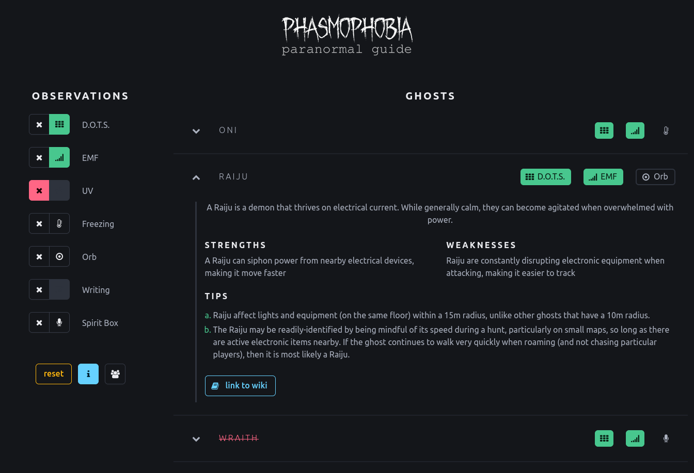
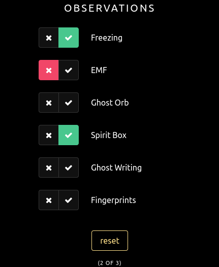
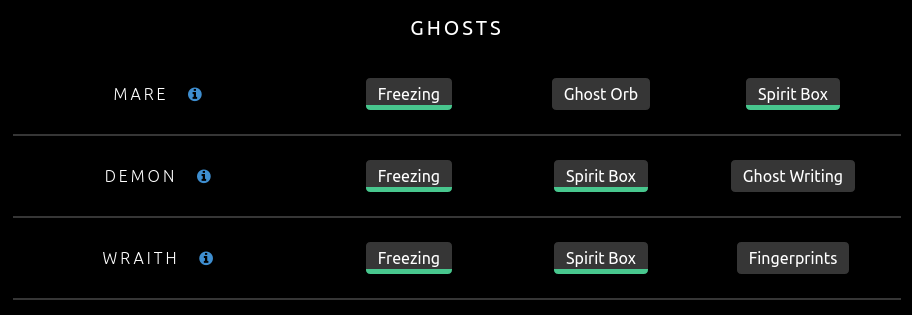
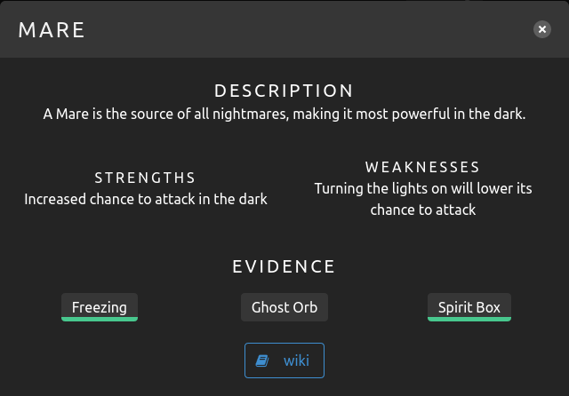

# Phasmophobia - Paranormal Guide

App to help identify ghosts in the Phasmophobia game.

Access the app here: **[LINK](https://hectorjsmith.gitlab.io/phasmophobia-guide/)**

## How to use

**1.** Select which evidence you have identified (or rulled out)

**2.** See which ghosts could match that evidence

_The table on the right will automatically update to only show ghosts that match those observations_

**3.** Look for the missing evidence

_The missing evidence section allows you to rule out evidence that is incompatible_

**4.** Get more information on each ghost

_Click on the blue "i" next to the ghost name to get more info_

## Running Locally

Use the following commands to build and run the project locally. This assumes you have a working Javascript/ReactJS development environment.

Note that while installation may require an internet connection to download dependencies, the app **is fully functional** when running locally or without an internet connection. This is because the app does not rely on any external files or data, all necessary data is available locally.

**1.** `npm install`

This installs all the necessary dependencies.

**2.** `npm start`

This runs the app locally. Once it has started, you can access the app at [http://localhost:3000/phasmophobia-guide](http://localhost:3000/phasmophobia-guide).

## Disclaimers

This project is a fun little weekend project to experiment building an app with Javascript and ReactJS. This project is in no way affiliated with the Phasmophobia game or its developers. All trademarks are the property of their respective owners.

The font used for the page heading image is "October Crow" by Sinister Fonts ([link](https://www.dafont.com/october-crow.font)).

This project also makes use of the following open-source tools:

- [ReactJS](https://reactjs.org/)
- [Bulma CSS](https://bulma.io/)

The project is currently hosted using Gitlab Pages. While the app itself does not collect, process, or transmit any user information or make use of any cookies, Gitlab may have access to certain information about users of the app. Please refer to [Gitab's Privacy Policy](https://about.gitlab.com/privacy/) for more information.
